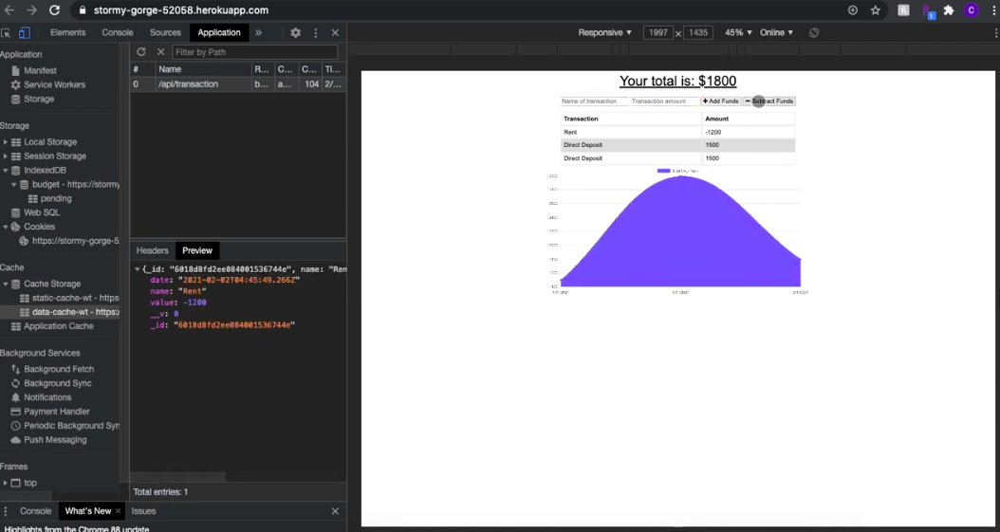

# Budget-Tracker
  


## Description
This website was developed as part of my week 18 homework assignment for the Coding Bootcamp at the University of Central Florida.

This program allows a user to track their budget both online and offline.

## Table of Contents
* [Installation](#installation)
* [Link](#link)
* [Usage](#usage)
* [License](#license)
* [Contributing](#contributing)
* [Tests](#tests)
* [Questions](#questions)


## Installation
To install necessarry dependencies, run the following command:

```
npm i
```

## Link
[Budget Tracker](https://stormy-gorge-52058.herokuapp.com/)

## Usage
Start by navigating to the website using the link above.

At start up, the user is presented with their budget total, two input fields with the option to either add or subtract funds and a graph displaying their transactions. When the user enters a transaction, it displays in a table below.

The app was designed so that the website still functions whether the user is online or offline. When offline, the user's inputs are stored in indexedDB until they can be synced when internet connection is restored.

See example demo here:
[](https://drive.google.com/file/d/1JV7uVS6i9GGzuTP3e39KbG6VWaYXhuY2/view?usp=sharing)

## License
This project is licensed under the terms of the MIT license.


## Contributing
Feel free to make a pull request and I'll look it over.


## Tests
There are no tests for this application.


## Questions
Have any questions for me? Contact me here:

Github: [@caitlincrews08](https://github.com/caitlincrews08)

Email: caitlinrcrews@gmail.com